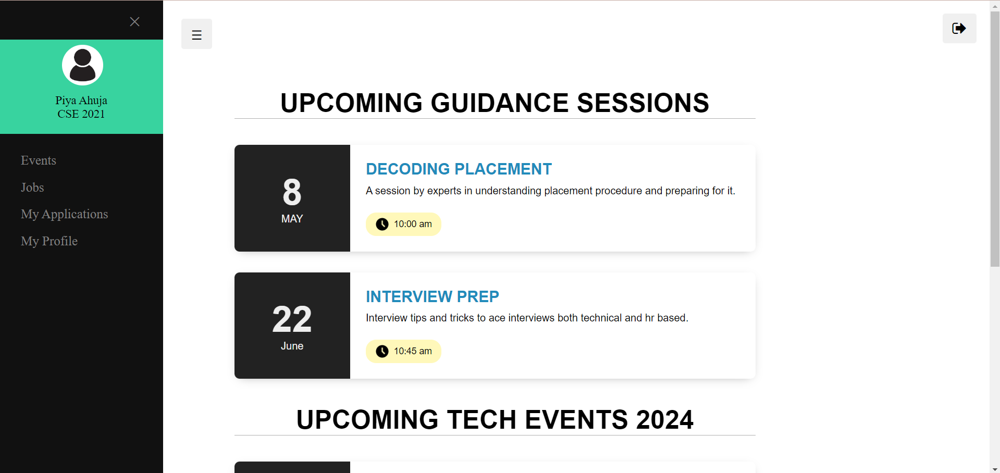
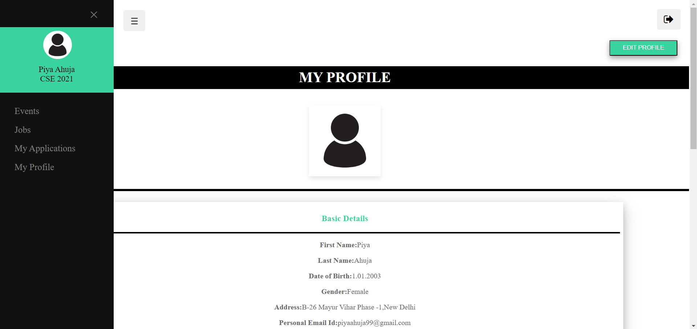

# IGDTUW Placement-portal

In colleges, the training and placement cell is crucial. The creation of a web portal for the training and placement cell is intended to assist in automating the manual tasks of the placement cell, such as gathering candidate information for filling out the application form for any particular company. This application can keep all the student’s data, including personal details and details about their education, abilities, and resume, among other things. Students can log on, see, and apply for any drives they’re interested in. All student-related data that is necessary for them will be available to the college’s TnP cell.

##Video Demo:
[Video](https://vimeo.com/935426605?share=copy)

##Screens:

Login Page:

Events:

Jobs

My Applications:

My Profile:
